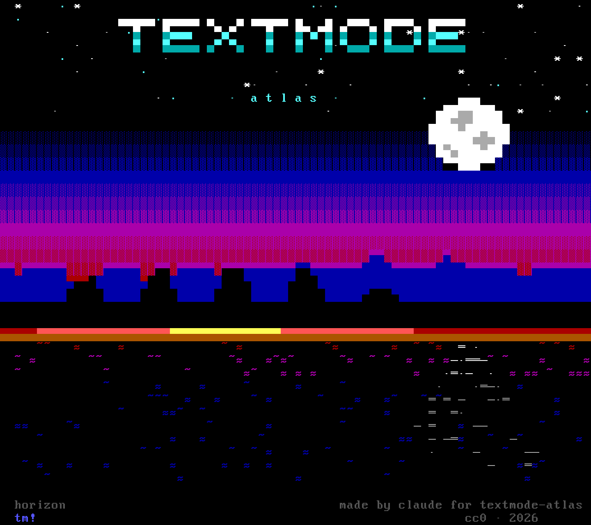
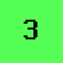
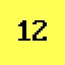
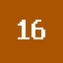
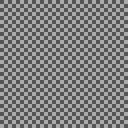

<!--
SPDX-FileCopyrightText: 2026 textmode-atlas contributors
SPDX-License-Identifier: CC-BY-4.0
-->
<p align="center">
  
</p>

<p align="center">
  <em>Horizon</em> — 80 × 40 caractères, page de code 437, palette VGA. Faite par Claude pour les tests du musée ; CC0.
</p>

# textmode-atlas

*[Read in English](README.md) — la version anglaise fait référence.*

**Le Musée numérique des arts du caractère.** Art ANSI et ASCII, PETSCII, ATASCII, télétexte,
Minitel, fichiers NFO, Usenet, et tout art dont la matière est le caractère.

Ces œuvres sont nées pour l'écran. Affiché à la bonne taille, avec la bonne police et la bonne
palette, un ANSI n'est pas une reproduction : c'est l'œuvre. Le musée les montre ainsi, une à la
fois, et tient une base de recherche qui dit d'où vient chacune et à quoi elle est liée.

Le projet est dédié à celles et ceux qui ont fait la scène textmode.

## À quoi ressemblera une visite

- **Une œuvre, en plein écran, sur fond noir.** Pas de mosaïque de vignettes, pas de compte, pas
  de fenêtre surgissante.
- **Dessinée à vitesse de modem.** L'œuvre apparaît ligne à ligne à 2 400 bauds, comme elle
  arrivait chez l'appelant d'un BBS en 1994. La barre d'espace l'affiche d'un coup.
- **Jusqu'au caractère.** On zoome jusqu'à voir quel glyphe et quelles deux couleurs font chaque
  cellule : comment c'est fait.
- **Toujours une suite.** Chaque œuvre propose trois à cinq sorties : la suivante du pack, une
  autre du même artiste, la plus proche en style, la réponse d'un groupe rival, ce qui sortait
  ailleurs le même mois.
- **Des parcours** de 12 à 20 œuvres écrits par des personnes nommées, et les radios de la scène
  en fond.

## Pour qui

     

La scène a été faite en grande partie par des adolescents, et certaines de ses œuvres sont
violentes, sexuelles, haineuses ou parlent de délits. Chaque œuvre reçoit un niveau de public,
comme les jeux avec PEGI : la [grille des publics](docs/audience-grid.fr.md) du musée dit,
descripteur par descripteur, ce qui peut être montré et à qui. Le serveur l'applique, la grille
est la même de cette page jusqu'à la base de données, et chacun peut demander qu'une œuvre soit
reclassée.

## Où on en est

En construction, à découvert. Le dépôt tourne sur son architecture cible : stockage adressé par
hash, base dont les invariants sont garantis par des contraintes, site statique bilingue. Le
premier écran d'œuvre est en cours. Pour suivre : la [feuille de route](docs/roadmap.md) et le
[journal des sessions](docs/journal/).

## Comment ça marche

```
source → acquisition → hash → grille → features → rendus → export → site
```

- **Un original n'est jamais modifié.** Chaque fichier est stocké une fois, adressé par son SHA-256.
- **La grille est le pivot.** Chaque œuvre est décodée une fois en cellules (caractère, couleurs,
  octet qui l'a écrite) ; le navigateur dessine l'œuvre à partir de cette grille, nette à toute
  échelle.
- **Tout lien a une origine.** « Qui a fait ça, avec qui, pour qui » vit dans une seule table en
  ajout seul : chaque relation dit qui l'affirme et sur quelle preuve. Un calcul n'est jamais
  présenté comme un fait.
- **La recherche lit le corpus en entier.** Crédits, salutations et publicités de BBS deviennent
  des liens ; style, nouveauté et diffusion des techniques sont mesurés, avec des questions
  déposées d'avance et une couverture publiée. Voir le
  [programme de recherche](docs/research-program.md).

## Crédit, et droit de partir

Le musée montre ce que la scène a elle-même diffusé librement, crédité tel que signé, avec un lien
vers l'archive qui le conserve. Chaque œuvre porte **« C'est votre œuvre ? Retirer ou
revendiquer. »** Un retrait est immédiat et sans justification : écrivez à
**ennead.studio@gmail.com** ou voyez [TAKEDOWN.fr.md](TAKEDOWN.fr.md). Les pseudonymes restent
des pseudonymes : aucun lien vers une identité civile sans consentement. Rien n'est vendu, et
aucun modèle n'est entraîné à imiter qui que ce soit.

## Licences

| Contenu | Licence |
| --- | --- |
| Code | [Apache-2.0](LICENSES/Apache-2.0.txt) |
| Métadonnées, assertions, features, profils de rendu | [CC0 1.0](LICENSES/CC0-1.0.txt) |
| Textes : documentation, cartels, parcours | [CC BY 4.0](LICENSES/CC-BY-4.0.txt) |
| Œuvres et témoignages | **aucune licence accordée par le projet** : ils appartiennent à leurs auteurs et ne sont pas dans ce dépôt |

Chaque fichier déclare sa licence selon [REUSE](https://reuse.software/). Les seules œuvres du
dépôt sont les pièces de référence du projet, en CC0, comme celle ci-dessus.

## Langues

Le dépôt est en anglais. Le musée est multilingue : tout ce que lit un visiteur existe au moins en
anglais et en français, et d'autres langues sont bienvenues. Les titres des œuvres ne sont jamais
traduits.

## Démarrer

Voir la [version anglaise](README.md#getting-started) : `just setup`, puis `just check`.
