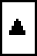
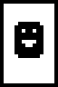
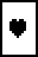
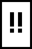
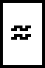
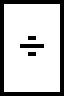
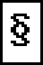
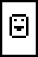
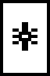

<!--
SPDX-FileCopyrightText: 2026 textmode-atlas contributors
SPDX-License-Identifier: CC-BY-4.0
-->
# Grille des publics (v1)

[English version](audience-grid.md)

Ce que le musée montre, et à qui. Adaptée de PEGI, le consensus européen sur ce qui est acceptable pour les publics protégés ; ce n'est pas PEGI, qui classe les jeux et dont les marques lui appartiennent. Générée depuis [corpus/ratings/grid.yaml](../corpus/ratings/grid.yaml) par `tm corpus ratings` : on modifie la grille, pas cette page. Décidée dans l'[ADR 0020](adr/0020-the-audience-grid.md).

## Niveaux

| | Niveau | Ce que cela veut dire |
| --- | --- | --- |
|  | **Tous publics** | Rien de cette grille. Une œuvre relue qui ne porte aucun descripteur. |
|  | **7 ans et plus** | Violence de dessin animé, images qui peuvent effrayer les jeunes enfants. |
|  | **12 ans et plus** | Imagerie d'horreur, violence envers des figures imaginaires, sous-entendus, jurons légers, alcool, la scène warez. |
|  | **16 ans et plus** | Violence réaliste et sang, nudité érotique, obscénités, drogues illégales, modes d'emploi d'actes illégaux, mots haineux montrés sans adhésion. |
|  | **Réservé aux adultes** | Violence extrême, sexe explicite, usage de drogues glorifié, œuvres qui promeuvent la haine (montrées seulement avec un texte de conservateur). |
|  | **Retenue** | Jamais montrée ni exportée. Conservée dans l'archive, en attente d'une décision du responsable et de l'avocat. |

## Descripteurs

| Descripteur |  |  |  |  |  |
| --- | --- | --- | --- | --- | --- |
|  **Violence** | Violence suggérée ou de dessin animé, sans détail (un combat entre figures imaginaires). | Violence visible envers des créatures imaginaires ; violence irréaliste envers des personnes ; armes brandies comme menace. | Violence réaliste envers des personnes, blessures, sang. | Violence extrême (gore, mutilation, torture), violence envers des personnes sans défense, meurtre glorifié. |  |
|  **Peur** | Images qui peuvent effrayer les jeunes enfants (crânes, monstres, ténèbres), dans un style irréaliste. | Imagerie d'horreur (démons, morts-vivants, symboles occultes, visages inquiétants). | Horreur graphique (corps déformés, images réalistes dérangeantes). |  |  |
|  **Sexe et nudité** |  | Sous-entendus, poses suggestives, baisers ; nudité partielle non sexuelle. | Nudité érotique ; activité sexuelle suggérée, non montrée. | Activité sexuelle ou organes génitaux explicites, entre adultes. | Toute représentation sexuelle impliquant ou paraissant impliquer un mineur, dessinée ou non. |
|  **Langage** |  | Jurons et insultes légers. | Obscénités, insultes à caractère sexuel. |  |  |
|  **Drogues** |  | Alcool ou tabac montrés ou cités. | Drogues illégales montrées ou citées. | Usage de drogues illégales glorifié, ou mode d'emploi. |  |
|  **Discrimination** |  |  | Insultes ou symboles haineux montrés dans une œuvre qui n'y adhère pas (cités, moqués, pris dans une histoire de la scène). | Une œuvre qui promeut la haine de personnes pour ce qu'elles sont ; montrée seulement avec un texte écrit par un conservateur. | Une œuvre qu'il serait illégal de publier, même dans une archive (incitation, négationnisme ; à vérifier avec l'avocat). |
|  **Délits** |  | La scène warez et le cracking nommés ou annoncés (groupes, couriers, BBS d'élite), comme histoire. | Modes d'emploi d'actes illégaux (carding, phreaking, intrusion). |  | Données volées utilisables (numéros de carte, codes d'appel, mots de passe) ou coordonnées d'une personne privée. |
|  **Personnes réelles** |  | Caricature d'une personnalité publique. | Représentation insultante ou dégradante d'une personne identifiable, pseudo de scener compris. | Représentation sexualisée d'une personnalité publique. | Représentation sexualisée ou dégradante d'une personne privée. |

## Avertissements

-  **Clignotements**: Cellules clignotantes ou redessins rapides, qui peuvent gêner les visiteurs photosensibles. La lecture peut être mise en pause, et la réduction des animations est respectée.

## Règles

1. Le niveau d'une œuvre est le plus haut niveau parmi ses descripteurs. Un cartel peut expliquer une œuvre, jamais abaisser son niveau.
2. La grille classe ce qu'une œuvre montre, dans son temps et son contexte, pas la personne qui l'a faite. Un descripteur s'applique à une œuvre, jamais à une personne.
3. Chaque descripteur est une assertion avec son auteur. Un programme peut le déduire ; un relecteur nommé le confirme ou le rejette ; l'artiste peut le déclarer. Rien n'est effacé, l'histoire d'un classement reste visible.
4. Tant qu'une personne ne l'a pas relu, un descripteur déduit par un programme compte. Une œuvre que personne n'a relue est « pas encore classée » et n'est montrée que là où le 16 l'est.
5. Les niveaux sont appliqués par le serveur quand il exporte et sert les œuvres, jamais par la page dans le navigateur.
6. Chacun peut demander qu'une œuvre soit reclassée, avec le même formulaire que pour un retrait.
